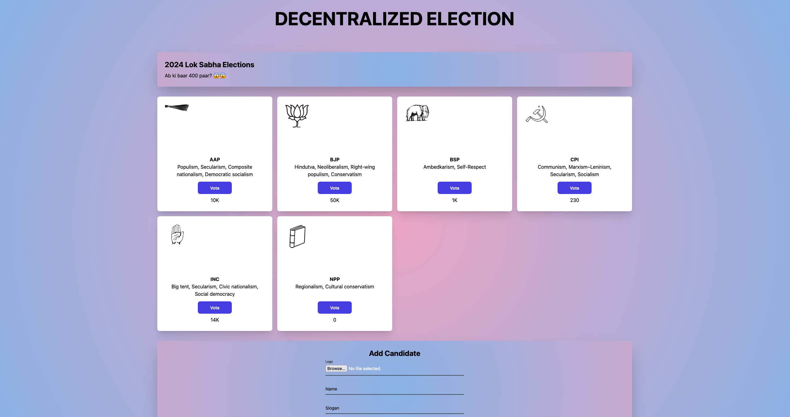

# Voting Dapp

This decentralized voting app allows an admin to add political candidates with their name, slogan, and logo, and allows voters to vote for their preferred candidates. The application is built using ReactJS for the frontend, Solidity for smart contracts, Hardhat for development and testing of smart contracts, Metamask for wallet integration, and IPFS (Inter Planetary File System) via Pinata service for uploading candidate logos.

## Features

1. **Add Candidate:** Admins can add candidates with their name, slogan, and logo.

2. **Add Voter:** Admins can add voters to the system.

3. **Vote for a Candidate:** Voters can cast their votes for the candidate of their choice.

All actions, including adding candidates, voters, and voting, are performed on the blockchain to ensure transparency and security.

## Prerequisites

Before running the application, make sure you have the following prerequisites installed:

- Metamask extension installed on your browser.

- Install [Node.JS](https://nodejs.org/en) on your system.

## Steps to Run the Application

1. Clone the Repository.

2. Setup and Deploy Smart Contracts.

   - Navigate to the project directory and run the following commands:
     - `make compile`
     - `make node`
     - `make deploy`
   - These commands will compile the smart contracts, start a local blockchain node, and deploy the contracts on the local node.

3. Run the Front-End:

   - Navigate to the client folder using the command.
   - Install the required dependencies using `npm install`.
   - Once the dependencies are installed, start the frontend server using `npm run dev`.

   This will start the frontend application and open it in your default browser.
